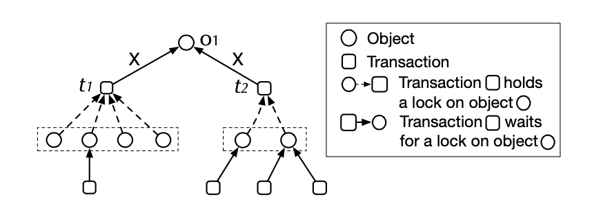

# 线程中的锁事

**锁的介绍**

&#x20;    为了解决上述章节的同步安全问题，一个最常见的解决方案就是加锁。通过加锁，保证了操作的原子性，只有获得锁的任务才能执行相关流程，从而保证最后得到的结果是可预知的。比如在电商系统中，下单支付后更改库存，通过使用悲观锁或者乐观锁来保证不会超售。

锁是用于控制多任务同时访问共享资源的一种同步机制。

通常，我们会将锁分成两大类，悲观锁和乐观锁。悲观锁即认为一定存在竞争，所以在处理之前加上互斥锁，存在排他性，只有获得到该锁的任务才能处理，其他的会被挂起。

相比于悲观锁，乐观锁认为不是总是存在冲突，它在处理之前不会像悲观锁一样加上锁，而是在执行数据更新时，利用版本号和CAS来实现数据的更新。比如Mysql中的MVVC，Java中的CAS更是随处可见，比如atomic下的多种原子类，locks下的锁等等。

\


**死锁、活锁**

&#x20;    锁是在并发编程中最重要的同步机制，但是也不能贪杯，不能过度使用锁，也不能随意使用。过度使用锁可能会降低整体性能，如果锁的粒度比较大，那就会导致几乎一直都是单个任务处理，此外由于上下文切换导致其性能还不如串行化处理方式。另外随意使用锁可能会出现死锁现象，这是一个比较常见，且严重的问题。想要避免死锁，就是要避免产生死锁的几大条件的发生。死锁产生的条件是：

1、非抢占式；非抢占保证了进程或者线程不会主动抢占其他已被占用的资源

2、互斥；资源占用具有排他性

3、请求和保持； 已经占用的资源不会被释放，会一直保持

4、循环等待；不同任务循环等待，首尾相接，形成了一个闭环；

&#x20;   看到了死锁的产生条件，我们就要避免其发生，这也是我们平时在开发时要注意的一点。解决策略主要也是分成两种，一是避免死锁，二是解决死锁。避免就是预防，不让死锁发生。比如对于不同的线程在申请资源时最好是同样的顺序。如有资源A和资源B，线程1，线程2在申请时，最好都保持先申请A，再申请资源B，不要反着来。此外还有一种著名的避免死锁的算法叫做银行家算法。感兴趣的可以参考：[详解操作系统之银行家算法（附流程图） - 知乎](https://zhuanlan.zhihu.com/p/384678500)

除了预防死锁的发生，也可以在死锁发生时进行处理，比如可以通过定时检测死锁，解除死锁等方式。

和死锁相对应的一个现象是活锁。活锁最大的特点它不会保持，还是上面的例子，线程1获取到A再获取资源B时，如果失败了，就会放弃资源A，再去重新获取资源A和B；线程2获取到B再获取资源A时，如果失败了，同样放弃资源B，再去重新获取资源B和A。也就是说，两个线程在获取不到全部资源时，就会放弃占用资源，随后接着再按照相同的顺序去获取资源，如此反复，导致两个线程永远获取不到全部资源，也不会执行响应任务。对于活锁，维基百科有比较好的解释：

> 两个人都没有停下来等对方让路，而是都有很有礼貌地给对方让路，但是两个人都在不断朝路的同一个方向移动，这样只是在做无用功，还是不能让对方通过。
>
> \
>

## 二、Linux中的锁

本文首先会介绍操作系统的锁，是因为其他语言或者应用都是借助操作系统的锁机制来实现的，因为我平时都是使用Linux，所以这里介绍Linux中的锁。

Linux做为一种典型的多用户、多任务的操作系统，通过特殊的同步机制来保证多任务并发或并行处理的安全性。主要包括信号量、互斥锁、自旋锁、读写锁、RCU等。

**信号量**

&#x20;     信号量英文叫做Semaphore，看到这，JAVA程序员应该很熟悉吧，多线程编程中，JAVA并发包提供了一个类叫Semaphore。在Linux中，同样有个叫Semaphore的机制，用于实现进程间的同步。其本质类似于一个计数器，它会在初始时设置成一个固定值，随后进程成功获取资源后，会将信号量减去1（对应的是P操作），释放后，信号量加1（对应的是V操作）。linux对应的结构体如下：

```
struct semaphore {
        spinlock_t                lock;
        unsigned int             count;
        struct list_head        wait_list;
};
```

其中count就是对应的信号量值，当然对count的加减操作是原子性的操作，且对其他进程（线程）可见。

只有当信号量为非负数时，才能获取资源，否则将对应的进程会线程放入等待队列wait\_list，并将其状态改为休眠。该等待队列本质上是一个链表结构，如下：

```
struct semaphore_waiter 
{         
        struct list_head list;         
        struct task_struct *task;         
        int up; 
};
```

当进程执行完之后，如果等待队列是空的，直接将count值+1，否则就会唤醒等待队列中的进程（或线程）。

通常情况，信号量主要是用于在同一时间只能被有限个任务访问处理的场景。比如同时我只允许最多100个人在打球，多了不可以。这有点像限流里的令牌桶，最多我发这么多，超过这些就不发了。为了直观，我用JAVA来演示信号量的使用。但还是要注意，Java的信号量的实现和Linux系统的是不一致的，只是适用场景比较类似。

```
  public class SemaphorePra {
  
    private static int count = 40;

    private static ExecutorService executorService = Executors.newFixedThreadPool(count);
   
   //这里定义了信号量的初始值，是10.
    private static Semaphore semaphore = new Semaphore(10);

    public static void main(String[] args){
        //这里可以观察线程处理的情况。
        for (int i=0;i< count;i++){
            executorService.execute(new Runnable() {
                @Override
                public void run() {
                    try{
                        semaphore.acquire();
                        System.out.println(String.format("thread:%s",Thread.currentThread().getName()));
                    }catch (Exception e){
                        e.printStackTrace();
                    }finally {
                        semaphore.release();
                    }
                }
            });
        }
    }
}
```

**互斥锁**

Linux通过mutex来实现互斥锁，其结构体如下：

```
struct mutex {
        /* 1: unlocked, 0: locked, negative: locked, possible waiters */
        atomic_t                  count;//原子操作类型变量
        spinlock_t                wait_lock;//自旋锁类型变量
        struct list_head          wait_list;
#ifdef CONFIG_DEBUG_MUTEXES
        struct thread_info        *owner;
        const char                *name;
        void                      *magic;
#endif
#ifdef CONFIG_DEBUG_LOCK_ALLOC
        struct lockdep_map         dep_map;
#endif
};
```

可以看到mutex和信号量比较类似，区别是其count只能是0或1两个值，其本质上也是信号量，所以也被称为二进制信号量。

那么问题是，count本身也是一个变量，又怎么保证获取并设置该标志位的过程是原子操作呢？

比较著名的一种做法是 test-and-set-lock(TSL，实际上就是咱们进场说的CAS)，是一种不可中断的原子操作，实现方式有硬件或者软件的方式，它将count变量读取寄存器 RX 中，然后在该内存地址上存一个非零值，读取操作和写入操作从硬件层面上保证是不可打断的，即保证原子性。

上述原子操作，在单核系统是完全没有问题的，但在多核系统中，虽然是原子操作，但单靠它是完全没法做到CPU间的同步的。基于此，操作系统可以通过控制总线（比如保持同一时间只能有一个处理器操作），基于缓存锁定（保证同一时间只有一个处理器在操作缓存）或者其他实现方式。

通过这种结构，可以保证资源使用的排他性，同时只能有一个任务占用该资源。传统的mutex中如果进程（线程）获取锁失败，会直接进入等待队列，等待锁释放重新竞争锁。后续Linux对此进行了改进，当获取锁失败时，可以先不进入等待队列，而是采用自旋的方式，不必挂起。这种方式的目的也是为了减少进程挂起唤醒等操作。

**自旋锁**

自旋锁spinlock,刚才也提到了，它的主要思想就是当没有成功获取到锁时，并不会进入休眠状态，而是自旋等待，直到获取资源。相比于互斥锁，它并不需要挂起再被唤醒。其应用场景一般都是需要等待的时间比较短的情况，而互斥锁和信号量可以是执行时间比较长的场景。对于自旋锁，如果等待时间较长，自旋过程会一直占用CPU，这在一定程度上也浪费了资源。为了解决这个问题，一是尽量在等待锁的时间较短的情况下使用，此外也不能一味地等待，在等待一定时间时还获取不到就应该失败。这在后面介绍Java自旋锁的时候也会介绍。

**读写锁**

读写锁rwlock，是针对互斥锁的一个改进，即当读操作时，锁是共享状态，当写时，是互斥锁。这样是为了避免所有情况都加互斥锁，从而提升了并发性能。在我们日常的开发中，也基本上是读多写少的场景，没必要一定要独占。这个就将共享和独占很好得结合到了一起，如果大家平常都使用Mysql得话，就会知道Mysql也提供了shared和独占的锁。

读写锁存在的模式即读模式锁，写模式锁，无锁。其中写锁的优先级要高于读模式锁。当有写锁时，其他具有读锁的都会被阻塞。

**RCU**

RCU，全称时Read-copy-update，是在linux2.6中引入的。有点像写时复制，即CopyOnWrite（这个在零拷贝中是比较有用的一个概念）。当只是读时，不需要加锁；当进行写操作时，会拷贝一份副本，然后在合适的时候会将执行旧数据的指针更新为执行新数据。

相比于读写锁，RCU最大的变化是进行写操作时，读锁不需要被阻塞。此外，就是其修改对于其他任务来说可能不是立即可见的，有滞后性。因此对于数据具有敏感性，需要实时读到最新的场景，RCU是不合适的。另外，RCU由于需要进行副本拷贝，还要进行删除旧数据等一系列操作，所以其写锁的开销成本较大。因此，RCU在写操作越少的情况，其性能就越好。

以上介绍了Linux的各种锁，并介绍各自的使用场景。在我们实际开发中可能并不会直接调用库函数来完成锁的实现，而是通过编程语言去调用，编程语言去负责Linux的系统调用。

下面主要介绍Java中的各种锁。

## 三、JAVA中的锁

JAVA中的锁是用来控制多线程同时访问临界区时最重要的方式。在1.5版本之前只有sychronized这一种内置锁，且是比较重量级的，在后续的版本中，引入了Lock接口，并提供多种锁，此外sychronized实现了四种不同状态的锁，从而提升系统的性能，同时加入了atomic类，引入了乐观锁，即CAS。也就是说目前JAVA的锁存在几大类：

sychronized

Lock接口实现的锁

atomic包下的CAS乐观锁

其中sychronized和Lock接口实现类本质上都是悲观锁，atomic包下的是采用CAS思想实现的乐观锁。悲观锁和乐观锁的区别不再赘述，首先说一下两种悲观锁的区别。

<figure><figcaption><p>悲观锁对比</p></figcaption></figure>

&#x20;&#x20;

&#x20;     从上面对比可以看到，Lock接口实现类提供了更加灵活、丰富的锁特性，如ReentantLock，可以配合Condition可以实现不同的条件等待，而配合synchronized使用的wait不能实现分条件的等待。此外，sychronized是从队尾开始唤醒线程。

但也不是说sychronized就不能用，如果我们不需要Lock所提供的特性，完全没必要使用Lock实现类，因为sychronized经过1.6的升级，性能也很好。接下来详细介绍一下这几种锁。

**Sychronized**

synchronized是Java的一个内置锁(JVM级别），是一种独占互斥锁。那么它到底是如何实现的呢？synchronized最传统（JDK1.6之前，现在只有膨胀到重量级锁才会出现）的锁依赖的是操作系统的Mutex Lock，关于mutex在Linux锁中已经有过介绍。这种传统的锁的方式比较重，因为如果线程抢不到锁的话，就会进入休眠状态，待有锁资源再被换起。休眠和换起的这两个状态，都是耗费CPU的，在1.6版本中又引入了轻量级锁和偏向锁。其主要思想也是尽量无锁，或者采用自旋锁的方式避免线程休眠和唤醒。自旋锁在上也有讲过。在JDK1.6之后，在自旋锁的原有基础上又提出了自适应自旋锁。自适应自旋锁重试次数或时间不再固定，而是由前一次在同一个锁对象的自旋时间及锁地拥有着的状态来决定。如果上一个自旋时间很短。那它这次也认为自己可以获得锁，这时它就允许自旋时间长一些。

虽然自旋锁有很多优点，但也只有在满足一定条件下才可能得到性能的提升，比如多核，比如任务不能太过耗费时间等等。

说了一大堆，看看Java的synchronized是如何实现的。

使用synchronized的代码块在编译的时侯会插入monitorenter和monitorexit字节码指令。


，enter是插入到同步代码块开始的地方，exit是在方法结束和异常的情况。如上图中有两个exit，主要是为了保证异常的情况下可退出，即其自身含有try...finally。

对于被synchorized修饰的方法，会被一个叫ACC\_SYNCHRONIZED的修饰，有该修饰的对象就会尝试获取锁资源。这里需要注意的是Sychronized锁定的都是对象。我们可能在实际应用中会有不同的使用方式：

1、实例前加synchronized，实际上锁住的是该实例对象；

2、在类前面加synchronized,锁住的是该类对象；

3、在同步块前加synchronized，锁住的是括号里的对象；

无论是何种方式，都是锁的是对象。假如说一个类对象里有两个不同的静态方法都加了synchronized，那么这个锁是这个类对象，相当于全局锁，因此即使访问把不同的方法，同样是互斥的。

对于非静态类方法，即实例方法，如果不同的线程操作的不同的对象，那么加锁是毫无影响的。如果是操作同一个实例对象，那会产生互斥。

对象应用的锁是保存在对象头中的，对象头中的MARK WORD主要存储hashcode，分代年龄以及锁的标志位头中保存的锁信息是什么，还要根据具体的锁机制有关，有重量级锁，轻量级锁还有偏向锁。

下图展示了MarkWord的锁信息。


JAVA对象头

整个synchronized锁的升级过程是 无锁->偏向锁->轻量级锁->重量级锁，且这个过程是不可逆的。

## 偏向锁

其加锁思路：

1、当对象第一次被线程获得锁的时侯，首先检查其是否是可偏向状态（可见上图的偏向锁标志位，且是无锁状态）；

2、如果是，那么线程会通过CAS获得偏向锁（将对象头的MarkWord中的线程ID指向自己），如果成功，则开始执行同步代码；如果失败，就往下走；

3、当发现当前对象的偏向锁是当前线程时（就是通过对象头中的线程id)，会不必再进行CAS操作，直接向线程栈中添加已调Display hdr是空的Lock Record，然后开始执行同步代码；

3、当发现当前对象的锁不是当前线程时，当到达安全局点（该时间节点没有任何字节码执行），首先会检查偏向的线程是否还存活，如果不存活，直接将对象锁状态置为无锁状态(01),然后获取锁，如果仍存活，就直接转向轻量级锁。

**释放锁：**

线程不主动释放偏向锁，只有遇到其他线程尝试竞争偏向锁时，持有偏向锁的线程才会释放锁，线程不会主动释放偏向锁，而他的释放也很简单，直接将Lock Record的只向对象的引用字段设置为null，并不需要CAS操作。

偏向锁的撤销，需要等待全局安全点（在这个时间点上没有字节码正在执行），它会首先暂停拥有偏向锁的线程，判断锁对象是否处于被锁定状态。撤销偏向锁后恢复到无锁（标志位为“01”）或轻量级锁（标志位为“00”）的状态。

\


偏向锁的应用场景基本上是实际上只有一个线程在执行同步块的任务。当前线程不需要再通过CAS操作，而是可以直接进入到同步块执行。也就是说偏向锁只是在替换MarkWord中的线程ID时需要进行一次CAS操作，其他情况不需要使用CAS。

当某个线程持有了偏向锁，且另外的线程竞争锁时就会升级为轻量级锁。

**轻量级锁**

\


轻量级锁流程（来自于并发编程的技术）

轻量级锁的获取锁的思路是：

1、若该对象无锁，虚拟机会在当先线程栈中建立一个名为Lock Record的空间，然后将目标对象头中的Mark Record拷贝过来，并记录指向对象mark record的指针。

这里的Lock Record的是线程私有的，每一个线程栈都会有一个Lock Record列表。

2、然后通过CAS（Compare and Set），试着修改对象的锁信息为自己的Lock Record地址，如果修改成功，即加锁成功，并将对象Mark Word中的锁标志位设置为“00；如果失败，向下走；

3、首先判断是不是对象锁指向的是当前线程栈的，如果是，证明是重入了，此时也证明获取锁成功，可执行同步代码块。

4、到这步，证明获取锁失败了，那么线程可以通过自旋锁的形式再次尝试获取锁，如果仍未成功（仍未成功是指自旋一定次数或时间仍然未获取到锁）或者同时又有其他线程来竞争锁，此时轻量级锁会直接膨胀为重量级锁。

解锁的过程是：

1、通过CAS操作尝试把线程中复制的Displaced Mark Word对象替换当前的Mark Word。

2、如果替换成功，整个同步过程就完成了。

4、如果失败，证明此时有其他线程在竞争锁，则直接膨胀为重量级锁。

以上是Synchronized锁的几个状态以及锁升级过程，可见偏向锁是为了避免进行CAS等操作；轻量级锁是通过CAS和自旋避免线程休眠和唤醒，重量级锁就是传统的做法，除了获取到锁的线程，全部阻塞。

由此可见Sychronized经过优化之后，通过不同的策略提升了性能，其实还有其他的优化，主要包括锁消除和锁优化。锁消除指的是在可以确定一定没有竞争的情况下，去除加的锁；锁优化是对在循环中反复加锁的，将锁移到循环外，避免频繁的加锁，释放锁等过程。

\


**Lock接口实现类**

1、ReentranLock

2、ReentrantReadWriteLock，其中使用了ReadLock 、WriteLock

可以看下Lock API


Lock接口

Lock的实现类都借助了AQS实现的。其实不仅仅是锁，还有其他的包括同步容器，比如Semaphore，CountDownLatch，FutureTask也都是基于此实现的。

AQS，全称\
AbstractQueuedSynchronizer，即同步器，如果看过该类的代码，你会觉得这就是艺术品，Doug Lea大神充分考虑了各种复杂的应用场景以及潜在的风险。本文不对该源码做分析，感兴趣的可以见我自己网站的一篇文章：[千与千寻-Java多线程共享变量同步机制及各种锁](https://hbnnforever.cn/article/javaconrulock.html)。

简单说下AQS的基本思想。AQS本身维护了一个volatile变量叫state，这个大家应该都很熟悉了，可以保证可见性和禁止重排序。

此外，其维护了一个FIFO的双向队列，队列本质上就是一个双向链表，特别的是其head是个虚拟的节点，除此之外，每个节点都是一个Node，Node包含当前的waitStatus，前驱节点和后继节点。这个队列本质上就是一个等待队列。


AQS双端队列简图

AQS支持互斥锁和共享锁两种模式，互斥锁就是ReentranLock这种，共享锁就是Semaphore,CountDownLatch这种。

这里就拿互斥锁来说。其获取锁的过程是：

1、线程尝试获取锁，这里调用的都是具体锁的实现类覆盖的方法，如ReentrantLock的tryAcquire；

2、如果获取成功，则直接执行同步代码块即可；如果获取锁失败，则继续向下进行； 3、将获取锁失败的前程通过CAS添加到队列尾部（这里处理比较特殊，可以看下源代码）；

4、线程开始自旋，如果前节点是头节点，就尝试获取锁，如果获取成功了，就更改头节点；如果前节点不是头节点或者获取锁失败了，且前节点的waitStatus是SIGNAL(这个表示处于休眠状态），也直接进入休眠；如果是取消状态，则prev指针往前移；如果是其他的，则将前节点的waitStatus设置为SIGNAL。随后将线程挂起，进入休眠状态。这里要说明一下，waitStatus不影响当前节点，只影响后节点使用；

5、如果持有锁的线程执行完释放锁之后，就会唤醒头节点的后继节点，这个地方也比较艺术，就是如果next节点是SIGNAL状态，就直接唤醒，否则从队尾从后往前遍历，直到找到队中第一个waitStatus小于0的，再唤醒。

上面说的互斥锁的释放比较简单，共享锁要麻烦一些，因为共享锁可以被多个线程持有，这就会出现释放锁的并发问题，因此AQS又引入了一个PROPGATE的waitStatus常量，该常量可以完美解决因为并发引起的bug，当然这也是后来才修复的，最开始还真没有，感兴趣的可以看源代码哈，这里不做过多阐述。

\


**ReentranLock**

\


关系图

该锁具备的特点一是可重入性，二是支持非公平和公平两种锁，三是可中断。

可重入性可以参考一下代码。以非公平锁为例，加锁的过程：

```
 final boolean nonfairTryAcquire(int acquires) {
            final Thread current = Thread.currentThread();
            //同步状态state，volatile变量
   						int c = getState();
            //处理尝试CAS加锁，并设置值为1（acquires传入的值基本上都是1）
            if (c == 0) {
                if (compareAndSetState(0, acquires)) {
                    setExclusiveOwnerThread(current);
                    return true;
                }
            }
            //如果是当前线程，更新计数
            else if (current == getExclusiveOwnerThread()) {
                int nextc = c + acquires;
                if (nextc < 0) // overflow
                    throw new Error("Maximum lock count exceeded");
                setState(nextc);
                return true;
            }
            return false;
        }
```

释放锁：

```
     protected final boolean tryRelease(int releases) {
            int c = getState() - releases;
            if (Thread.currentThread() != getExclusiveOwnerThread())
                throw new IllegalMonitorStateException();
            boolean free = false;
            //如果重入锁全部释放了，就返回告知已经全部释放
            if (c == 0) {
                free = true;
                setExclusiveOwnerThread(null);
            }
            //更新释放后的state
            setState(c);
            return free;
        }
```

ReentrantLock第二大特点就是支持非公平和公平锁，非公平锁上面的代码已经展示了，即不会遵循FIFO，就算是后来了一个线程，也有可能先获得锁。其次是公平锁，公平锁会借助AQS的同步队列实现，调用如下函数：

```
    public final boolean hasQueuedPredecessors() {
        // The correctness of this depends on head being initialized
        // before tail and on head.next being accurate if the current
        // thread is first in queue.
        Node t = tail; // Read fields in reverse initialization order
        Node h = head;
        Node s;
        return h != t &&
            ((s = h.next) == null || s.thread != Thread.currentThread());
    }
```

只有满足以上条件才会获取锁，从而保证了公平性。

三是可中断，可中断也是利用了AQS的特性。

可以看到使用AQS的几大类，都是利用了AQS的state，等待队列等特性。

ReentrantLock： state只能为0，1。独占锁，只有为0，且CAS成功变成1才会获得锁。

Semaphore：state初始一个数，同时最多有不超过该数目的线程获取到资格。释放时会把该值+1.

CountDownLatch：它的利用机制比较有意思。这个类的作用是同步，比如有三个任务，A，B ,C，只有A，B执行完，才能执行C。该对象也会在初始化的时候初始一个state.然后此时一个线程（通常是主线程）调用await，该方法发现state不是0，就进入等待队列。其他线程执行完会执行countDown，将state-1,当state变成0，被阻塞的线程会被唤醒。

ThreadPoolExecutor：线程池中的Worker使用了AQS，独占锁，保证了当线程正在运行时，调用shutdown中断不了，只能中断空闲线程。


**ReentrantReadWriteLock**

相比于ReentrantLock，ReentrantReadWriteLock升级为读写锁。

\


ReentrantReadWriteLock

可以看到ReentrantReadWriteLock实际上使用了读锁和写锁，但并不是两把锁，还是同一把锁。它的实现原理是通过对int状态变量进行拆分，低16位表示写锁，高16位表示读锁。其他方面和ReentrantLock基本一致。

\


\


对应的源码如下：

```
        static final int SHARED_SHIFT   = 16;
        static final int SHARED_UNIT    = (1 << SHARED_SHIFT);
        static final int MAX_COUNT      = (1 << SHARED_SHIFT) - 1;
        static final int EXCLUSIVE_MASK = (1 << SHARED_SHIFT) - 1;

        /** Returns the number of shared holds represented in count  */
        static int sharedCount(int c)    { return c >>> SHARED_SHIFT; }
        /** Returns the number of exclusive holds represented in count  */
        static int exclusiveCount(int c) { return c & EXCLUSIVE_MASK; }
```

注意读写锁的加锁和释放过程。

在获取写锁的过程，如果当前线程已经有读锁或者其他线程持有读写锁，该线程都会进入等待队列，这是因为写锁本质上是排他锁，为了保证数据可见性，在写锁过程中，其他读写都会被阻塞。

```
final boolean tryWriteLock() {
            Thread current = Thread.currentThread();
            int c = getState();
           //c不为0证明，有读锁或者写锁
            if (c != 0) {
                int w = exclusiveCount(c);
               //w=0表示有读锁，或者 当前写锁不是当前线程
                if (w == 0 || current != getExclusiveOwnerThread())
                    return false;
                if (w == MAX_COUNT)
                    throw new Error("Maximum lock count exceeded");
            }
            //利用CAS操作获取写锁
            if (!compareAndSetState(c, c + 1))
                return false;
            setExclusiveOwnerThread(current);
            return true;
        }
```

在获取读锁的过程，只要没有线程获取到写锁，读锁基本上都是可以成功获取的，因为其是一种共享锁。如果有写锁，那么就要进入等待队列。

```
final boolean tryReadLock() {
            Thread current = Thread.currentThread();
            for (;;) {
                int c = getState();
               //如果有写锁，且写锁不是当前线程的。
                if (exclusiveCount(c) != 0 &&
                    getExclusiveOwnerThread() != current)
                    return false;
                int r = sharedCount(c);
                if (r == MAX_COUNT)
                    throw new Error("Maximum lock count exceeded");
              .......     
        }
}
```

读写锁的使用也比较简单，下面是一个简单的例子。

```
 private List<String> aList;
    private ReentrantReadWriteLock reentrantReadWriteLock = new ReentrantReadWriteLock();;
    
    public void get(){
       //读锁
        reentrantReadWriteLock.readLock().lock();
        try {
            System.out.println(aList.get(0));
        }finally {
            reentrantReadWriteLock.readLock().unlock();
        }
    }
    
    public void write(String value){
       //写锁
        reentrantReadWriteLock.writeLock().lock();
        try {
            System.out.println(aList.add(value));
        }finally {
            reentrantReadWriteLock.writeLock().unlock();
        }
    }
```

\


**原子类**

JAVA并发包提供了一系列原子类，通过使用原子类可以实现无锁编程。


JAVA并发包的原子类

通过使用原子类，在并发编程中，不需要再显示去加锁，即开发者完全可以忽略线程安全性的问题。其基本原理就是使用volatile和CAS完成的，这里拿AtomicInteger为例。

```
 //value为volatile变量
private volatile int value;

//CAS操作
public final boolean compareAndSet(int expect, int update) {
       //valueOffset是内存偏移量
        return unsafe.compareAndSwapInt(this, valueOffset, expect, update);
    }
```

Unsafe是JAVA提供的可以直接操作操作系统的类，可以进行内存管理，CAS操作，线程调度等等，但日常开发中，基本上是用不到的。

当然，原子类虽然好，但CAS操作还存在一个比较普遍的问题，即ABA问题。就是有个线程在修改的时候值是A，但可能值是被别的线程从A改到B，又从B改到A。那解决ABA问题，常见的方案就是加上版本号，每次进行update时，不仅比较当前值是否相等，还要比较版本号是否一致。原子类中就有一个类似的实现类可以使用:AtomicStampedReference。该类通过一个二元组，即保存值，又保存版本号。

```
 private static class Pair<T> {
      //引用
        final T reference;
       //版本号 
       final int stamp;
    }

public boolean compareAndSet(V   expectedReference,
                                 V   newReference,
                                 int expectedStamp,
                                 int newStamp) {
        Pair<V> current = pair;
        return
         //地址和版本号要同时相等
            expectedReference == current.reference &&
            expectedStamp == current.stamp &&
            ((newReference == current.reference &&
              newStamp == current.stamp) ||
             casPair(current, Pair.of(newReference, newStamp)));
    }
```

\


以上介绍了Java中使用的锁，包括内置锁和Lock接口实现类锁，还有无锁的CAS。其实还有其他的同步器本文没有介绍，比如信号量,CountDownLatch等等，感兴趣的可以看《JAVA并发编程的技术》这本书，介绍的还是比较细致的。


上面介绍完JAVA的锁，再说下JAVA中的另外几个利器。

TLAB

volatile

**TLAB**

于对象的实例化要经过对象创建、内存分配、指针应用等过程。所以在多线程下会造成不安全。想解决该问题，我们可以通过同步锁来实现；此外，JVM引入了一个TLAB（Thread-Local Allocation Buffers）的概念，他为每个线程在堆上都申请一块内存，不同线程之间是相互独立的，在对象分配内存时尽量在TLAB上分配，不足时再到普通的堆上分配。TLAB比较好的介绍： [https://www.cnblogs.com/zhxdick/p/14371562.html](https://www.cnblogs.com/zhxdick/p/14371562.html)

**volatile**

其作用有两个，保持可见性和重排序。


被其修饰的变量保证内存可见性，意思是说一个线程对变量的修改，其他线程是可以看到的。它的实现方式主要是通过操作系统层面，即在执行写操作的时侯，CPU会在总线发送一个Lock指令（或者采用缓存锁定），使得当前只能有一个处理器处理内存数据，上面也提到过了。

虽然volatile保证可见性，但是还要格外注意，避免非原子性的操作，否则会出现异常，比如下面这个例子：

```
public class LockPra {

    public static volatile Integer s = 0;
    public static ReentrantLock lock = new ReentrantLock();

    public class Thre implements Runnable {

        public  void test(){
            s++;
            log.info("{} set s into {}",Thread.currentThread().getName(),s);
        }

        @Override
        public void run() {
            log.info("start thread:{}",Thread.currentThread().getName());
            test();
            log.info("thread:{} fininshed",Thread.currentThread().getName());
        }
    }


    public void runLock(){
        log.info("Start main at {}",DateLib.getTime());
        ExecutorService executorService = Executors.newFixedThreadPool(10);
        for (int i=0;i<9;i++){
            executorService.execute(new Thre());
        }
        executorService.shutdown();
       try{
           Thread.sleep(1L);
       }catch (Exception e){

       }
        log.info("End main at {},S:",DateLib.getTime(),s);
    }

}
```

s++是一个非原子性的操作，首先执行读，然后写，读和写并不是原子操作。结果就像下面：


线程1和2在读的时侯都获取了当前最新值0，当线程1修改了i的值，线程2中的i值失效了，但是由于读写不是原子操作，此时它并不会再去读一次线程i的有效值，而是直接执行了+1的操作，所以都更新了当前的值为1。如果要实现同步，还是要加锁。volitale更适合一写，多读的情况或者至少写操作不依赖于当前变量的值。

volatile的实现原理就是通过加入内存屏障。

\
(1)在volatile写操作的前面插入一个StoreStore屏障。保证volatile写操作不会和之前的写操作重排序。\
(2)在volatile写操作的后面插入一个StoreLoad屏障。保证volatile写操作不会和之后的读操作重排序。\
(3)在volatile读操作的后面插入一个LoadLoad屏障+LoadStore屏障。保证volatile读操作不会和之后的读操作、写操作重排序。

说到内存可见性，除了volatile，还有锁，以及final。锁自不必说。说一下final

final也可以保证内存的可见性，意思是一旦构造器初始化完成被final修饰的变量，且没有通过this引用传递，那么其他线程就能看见final变量的值。

对于final的介绍可以看这篇文章： [final关键字深入解析](https://juejin.im/post/5b8821b5e51d4538a108c969)

volatile变量第二个特性：可以保证代码有序性。

因为处理器本身在执行代码的时侯，会根据情况进行优化，可能会发生指令重排，即程序执行的顺序可能和代码编写顺序不一致。volatile可以保证有序性。有序性到底有何好处呢？

一个非常著名的就是单例模式的DCL（Double Checking Lock).

```java
public class TestL {

    public static Signle signle;

    public Signle getSignle(){
        if(null == signle){
            synchronized (this){
              if(null == signle){
                signle =  new Signle();
              }
            }
        }
        return  signle;
    }

    public class Signle {
        
    }
}
```

上面一是判断单例是不是null，如果是null，利用同步锁，初始化。乍一看，没啥问题的。当判断不是null时，尝试获取锁，获取成功就实例化对象。

但上面的操作在多线程可能会出现错误，某个线程可能会获得一个未初始化完成的实例。

一个对象的初始化其实是分几步来进行的：

1、内存地址分配；

2、初始化对象；

3、将内存空间地址赋值给对象的引用。

在初始化的过程中，非常有可能因为指令重排，导致步骤2和3执行顺序颠倒。而这引起的一个问题就是，假如线程A在初始化的过程中，但还并未实际初始化对象的时，线程B判断此时并不是null（第一个null），就直接返回这个不成熟的对象，那么此时就会出现问题的。

而利用volatile修饰变量，就可以解决这个问题，它会禁止2和3两个步骤重排序。

注意synchronized的有序性和volatile的有序性不一样。synchronized有序性是多线程串行执行，不能保证线程内的指令重排。volatile的有序性即是禁止指令的重排序。因此DCL是需要volatile修饰变量的。


在Java中有个原则叫做happens-before原则：

* 程序顺序规则：同一个线程中的，前面的操作 happen-before 后续的操作。（即单线程内按代码顺序执行。但是，在不影响在单线程环境执行结果的前提下，编译器和处理器可以进行重排序，这是合法的。换句话说，这一是规则无法保证编译重排和指令重排）
* 监视器锁规则：对一个锁的解锁，happens-before于随后对这个锁的加锁。
* volatile变量规则：对一个volatile域的写，happens-before于任意后续对这个volatile域的读。
* 传递性：如果A happens-before B，且B happens-before C，那么A happens-before C。
* start()规则：如果线程A执行操作ThreadB.start()（启动线程B），那么A线程的ThreadB.start()操作happens-before于线程B中的任意操作。
* join()规则：如果线程A执行操作ThreadB.join()并成功返回，那么线程B中的任意操作happens-before于线程A从ThreadB.join()操作成功返回。
* 程序中断规则：对线程interrupted()方法的调用先行于被中断线程的代码检测到中断时间的发生。
* 对象finalize规则：一个对象的初始化完成（构造函数执行结束）先行于发生它的finalize()方法的开始。

JVM通过内存屏障实现了有序性，禁止指令重排，内存屏障是一组处理器指令，具体的可以网上查阅，只要知道volatile变量保证下面两点：

1）当程序执行到volatile变量的读操作或者写操作时，在其前面的操作的更改肯定全部已经进行，且结果已经对后面的操作可见；在其后面的操作肯定还没有进行；

2）在进行指令优化时，不能将在对volatile变量访问的语句放在其后面执行，也不能把volatile变量后面的语句放到其前面执行。

说到DCL，额外延伸，除了使用volatile解决双重检查锁定问题外，还有一种方法可解决DCL，那就是基于类的初始化。

```java
public class TestL {

    private static class ClassInstan {
        public static Signle signle = new Signle();
    }

    public Signle getSignle(){
       return ClassInstan.signle;
    }

    public class Signle {

    }
```


\


## 四、Mysql锁

**锁的分类**

本文主要谈论InnoDB引擎的锁。下面是我画的一个思维导图，主要从不同维


Mysql锁多维度划分

**基于锁的属性分类：共享锁、排他锁**

**共享锁（S）：**加上共享锁之后，对应数据集合（行锁或者表锁）只能读，不能修改。当然共享锁可重复加，他也会阻止其他事务获取对应的排他锁。

现在我开启一个事务并加上共享锁。

```
mysql> begin;select * from c_group where user_id=33 lock in share mode;
Query OK, 0 rows affected (0.01 sec)

+-------+---------+-----------+--------+
| id    | user_id | groupname | avatar |
+-------+---------+-----------+--------+
| 10016 |      33 | dwdaaa    | dwd    |
+-------+---------+-----------+--------+
1 row in set (0.00 sec)
```

我再开启一个事务，执行修改。

```
mysql> begin;
Query OK, 0 rows affected (0.00 sec)

mysql> update c_group set groupname="dwd" where user_id=33;
ERROR 1205 (HY000): Lock wait timeout exceeded; try restarting transaction
```

**排他锁（X）：**排他锁就是我加上了，别人不可加任何的锁了,无论是共享锁还是排他锁，有时也称为排他写锁。

我再开启一个事务：

```
mysql> begin;select * from c_group where user_id=33 for update;
Query OK, 0 rows affected (0.00 sec)

+-------+---------+-----------+--------+
| id    | user_id | groupname | avatar |
+-------+---------+-----------+--------+
| 10016 |      33 | dwd       | dwd    |
+-------+---------+-----------+--------+
```

这个开启了一个排他锁。

然后再打开一个事务：

```
ysql> begin;
Query OK, 0 rows affected (0.01 sec)

mysql> update c_group set groupname="dwd" where user_id=33;
ERROR 1205 (HY000): Lock wait timeout exceeded; try restarting transaction
mysql> select * from c_group where user_id=33 ;
+-------+---------+-----------+--------+
| id    | user_id | groupname | avatar |
+-------+---------+-----------+--------+
| 10016 |      33 | dwd       | dwd    |
+-------+---------+-----------+--------+
1 row in set (0.00 sec)

mysql> select * from c_group where user_id=33 lock in share mode;
ERROR 1205 (HY000): Lock wait timeout exceeded; try restarting transaction
```

另外有一点需要说明以下，多个事务的update，会被Mysql按事务开始顺序串行化处理，当然肯定是commit之后。

\


**基于锁的粒度分类：表锁、行锁、记录锁、间隙锁、临键锁、插入意向锁。**

**表锁**：即对整张表加锁，当我们进行DDL（DML)操作或者查询条件没有索引的时候，都会使用表锁。当然也可以显示加表锁如Lock Table .....read (write)等。

行锁在MyIsam中不存在，InnoDB支持行锁。的生效必须是通过索引查询的记录，否则不会生效。通过索引加的锁可以是单行，也可以是多行数据。其实记录锁，间隙锁，临建锁，插入意向锁都属于行锁的范围。

**记录锁：**精准锁住一条记录，一般都过主键或者唯一索引查询即可假如记录锁；

**间隙锁**：索引区间锁。和记录锁只锁住一行不同，间隙锁会把一个区间锁住。

简单得就是我们查询一个范围：

```
   mysql> begin;select * from c_group where user_id in (1,2,3) for update;
```

事务提交前，不会允许插入或删除，解决了幻读的问题，当然只在RR隔离级别有效（这也是默认得隔离级别）。

比如我现在开启一个事务A，然后开启一个事务B

事务B执行：

```
 select * from c_group where user_id>=123  and user_id<130;
+-------+---------+-----------+--------+
| id    | user_id | groupname | avatar |
+-------+---------+-----------+--------+
| 10019 |     123 | wdw       | qee    |
| 10022 |     124 | wdw       | qee    |
| 10024 |     125 | wdw       | qee    |
+-------+---------+-----------+--------+
```

然后事务A执行insert,commit

```
insert into c_group (`user_id`,`groupname`,`avatar`) values(126,"wdw","qee");
```

因为MVCC快照读，事务B读到的还是上述结果。

```
ysql> select * from c_group where user_id>=123  and user_id<130;
+-------+---------+-----------+--------+
| id    | user_id | groupname | avatar |
+-------+---------+-----------+--------+
| 10019 |     123 | wdw       | qee    |
| 10022 |     124 | wdw       | qee    |
| 10024 |     125 | wdw       | qee    |
```

好，事务B执行insert,插入事务A同样的数据。

```
mysql> insert into c_group (`user_id`,`groupname`,`avatar`) values(126,"wdw","qee");
ERROR 1062 (23000): Duplicate entry '126' for key 'user_id'
```

这就是幻读的一种。

一种解决方式就是使用间隙锁。下面方式就是一种间隙锁的方式。

> SELECT \* FROM child WHERE id > 100 FOR UPDATE;

在事务中查询直接用select for update，这样就加了间隙锁。加了间隙锁之后，整个范围区间都会被锁住，即使对应数据可能不存在。因此假如间隙锁之后，其他事务就没法插入数据了，会被锁住，从而也就不会出现幻读了。

**插入意向锁**：插入意向锁其实是一种特殊得间隙锁，当执行insert的时候会有插入意向锁。上面提到间隙锁阻止其他事务插入，解决幻读的问题，实际上就是间隙锁和插入意向锁的冲突。但是插入意向锁和插入意向锁之间是不会冲突的，即当我们在同一个间隙内执行两个不同id的插入，是不会冲突的。

**临键锁：**是记录锁和间隙锁的组合，既解决脏读，也解决幻读。它锁住的是当前记录以及记录之前的数据，和间隙锁的开区间不同，临建锁是闭区间。比如我查询的是 id in (1,5,7)，那么它锁住的是(-∞, 1]，(1, 5]，（5，7]。

**基于是否可以锁住同步资源：悲观锁和乐观锁**

这个就比较好理解了，因为在前面很多地方都提到过。我们通过select for update或者update ,delete加的都是悲观锁。通过悲观锁可以确保数据的一致性和准确性。但有时我们遇到的都是读多写少的情况，并不需要总是加悲观锁，即认为多数情况不会冲突，因此可以使用乐观锁。Mysql并没有提供现成的乐观锁供开发者使用，开发者需要借助额外的字段来实现，比如最常见的就是增加版本号字段。当在执行更新操作时，只有版本号和查询版本号一致的时候才可更新成功。

```
select version from users where id=1;
update users set name='he' where id=1 and version=version;
```

**基于状态：意向共享锁和意向排他锁**

这两种锁是表级锁。当事务A对某个表中的某一行执行update操作时，为该行加入了行锁的同时，还会加入一个意向排他锁，假如有另外一个事务B想要锁表，那发现有意向排他锁，就会被阻塞。通过意向排他锁，事务B不需要校验每一行是否有排他锁，只需要看是否有意向排他锁就可以，大大提高了效率。但要注意，意向排他锁只是会限制表锁，不会和行锁发生冲突。

\


**死锁问题**

上面讲到了各种锁的分类，锁是保证同步的重要机制，但有锁的存在，势必会出现死锁的情况。那么出现死锁，Mysql是如何处理的呢？

处理方式主要包括两种，一是超时，二是死锁检测。超时比较好理解，事务长时间不提交，通过变量innodb\_lock\_wait\_timeout控制，超时就自动回滚；

```
mysql> show variables like "%innodb_lock_wait_timeout%";
+--------------------------+-------+
| Variable_name                   | Value |
+--------------------------+-------+
| innodb_lock_wait_timeout | 120   |
+--------------------------+-------+
```

二是死锁检测，其基本原理就是构建一个以事务为顶点、锁为边的有向图，判断有向图是否存在闭环，如果存在就证明有死锁。

<figure><figcaption></figcaption></figure>

具体实现这里就不做分析了。

上面是提到了死锁的处理方式，但解决死锁最好的方式还是预防，这就取决于我们平时写的sql了。总结几个尽量预防死锁的方式：

1）尽量避免大事务，避免长时间占用资源；

2）要保证顺序性，这个在开始死锁的介绍也提到过。比如每个事务都是处理资源1，资源2，资源3，要保证每个事务都是按照同样的顺序去处理；

3）避免一个事务同时占用过多的资源。这可以通过优化索引设计，sql等环节来实现。

4）事务中要使用索引或者主键来定位数据，避免占用过多的行，尤其是尽量避免表锁， 记录锁最好。

\


好了，上面说了Mysql的各种锁的分类，还要说下Mysql事务的隔离级别，因为Mysql的锁和事务的隔离级别息息相关。

\


**事务的隔离级别**

事务的隔离性指的是一个事务通常来说对其他事务是不可见的。但这只是通常，而不是我们所认为的一定是。因为这还要取决于存储引擎所采用的隔离级别。隔离级别主要有四种RU、RC、RR、SERIALIZABLE等。

1、RU

全称READ UNCOMMITED,是未提交读。意思就是事务可以读取其他未提交事务中的数据。这个引起的最大问题就是脏读。在事务未提交之前读到了数据，可能因为回滚，事务未成功执行。这种隔离级别我们在实际应用中不会使用。

2、RC

全称READ COMMITED，是提交读，一个事务只能读取另外一个事务已经提交的数据，事务提交之前的数据不可读。但这种隔离级别不可重复读，即在一个事务中读取一个数据，如果在这个事务执行期间，这个数据在不断地被其他数据修改，那么该事务中每次读到的事务都是修改之后的数据，即不可重复读。RC级别下，只会有记录锁，不会存在间隙锁。

3、RR

全称 REPEATABLE READ，可重复读。这也是Mysql的默认隔离级别。该隔离级别可以保证在同一个事务中多次读取的数据一定是一致的，不论该数据是否已经发生变化，这也就解决了上述所说的脏读。

但是呢，RR同样会存在另外一个问题，即幻读。所谓幻读就是在一个事务中，执行了一次查询操作，当再次读取时，可能另外一个事务执行了插入操作，当在事务又查询了一次，且另外一个事务新插入的事务也符合这个查询条件，那么这种现象就是幻读。

InnoDB已经帮我们解决了幻读的问题。它是通过MVCC实现的，当然只能在RC和RR两个隔离级别下。俗称快照读。但快照读开始的时间是第一次执行select的时候。

MVCC基本思想就是在聚簇索引中的每行数据加上两列。

**DB\_TRX\_ID:** 记录操作该数据事务的事务ID，是一个版本号，每开启一个事务就+1；

**DB\_ROLL\_PTR：** 指向上一个版本数据在undo log 里的位置指针；

读操作只会读小于等于当前事务的数据。

说白了，就是select是快照读，Insert,update,delete为当前读。快照读是通过MVCC，当前读是通过锁实现的。那对于RC和RR两个不同的隔离级别来讲，一个是只要提交就能看见，一个是针对快照读，可重复读。这两种现象的实现都是依靠MVCC的READ VIEW以及上面两个隐藏列实现。而这两者的区别是他们创建READ VIEW的实际不同，RC级别会在每次执行事务都会创建一个READVIEW，RR级别是只会在第一次事务执行时才会创建READ VIEW，在随后的事务执行中，commit之前都会使用同一个 READ VIEW。

&#x20;    而对于哪些事务是可见或者不可见的，依赖于READ VIEW的多个属性来实现，其中包括min\_trx\_id，活跃事务列表，下一个待分配的id,max\_trx\_id等。举例来说，如果当前事务id小于min\_trx\_id，那么就是可见的，如果在活跃事务列表中，则是不可见的。如果感兴趣的可以看下源码或者其他参考书。


不过，MVCC基本解决了幻读，但并不是完全避免。在RR级别下，通过间隙锁就可以解决幻读的问题，在上面介绍间隙锁时已经介绍过了。


4、Serializable

串行化，这是最简单的一种级别，也是最低效的，一般情况下不会用的。它是事务串行化执行。类似将所有事务放到一个队列中，然后依次取出执行。基本上也不会使用。

\


好了，到这里，关于Mysql锁的介绍也基本上完成了，其实还有很多没介绍的，比如主键id的Auto-Inc锁等等。上面说的都是锁的分类，那Mysql锁的底层时靠什么实现的呢？

对于InnoDB引擎来说，其是一个多线程的处理引擎。其通过封装系统的mutex和信号量实现了互斥锁和读写锁。关于互斥锁和读写锁在Linux的锁介绍中已经介绍过，或者感兴趣的可以看下面的参考资料。
